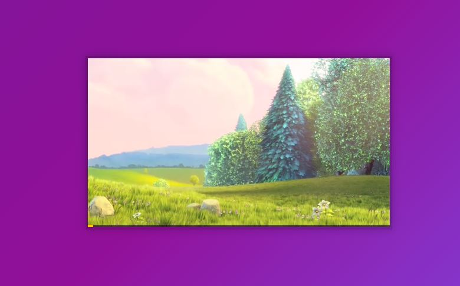

# CustomVideoPlayer

This is from day 11 / 30 of Wes Bos' JavaScript30 course.  In this lesson we used JavaScript to customize an HTML video player.  This was a fun lesson and if you're interested you can find the video <a href src="https://www.youtube.com/watch?v=yx-HYerClEA&list=PLu8EoSxDXHP6CGK4YVJhL_VWetA865GOH&index=11&pbjreload=101">here.</a>

 
 
After the lesson was over I wanted to put my own touch on the project so I added a full screen button and the functionality to make the video player go full screen when the button was clicked.  I used an "onClick" in the HTML and the element.requestFullScreen() method to adjust the width.

 

